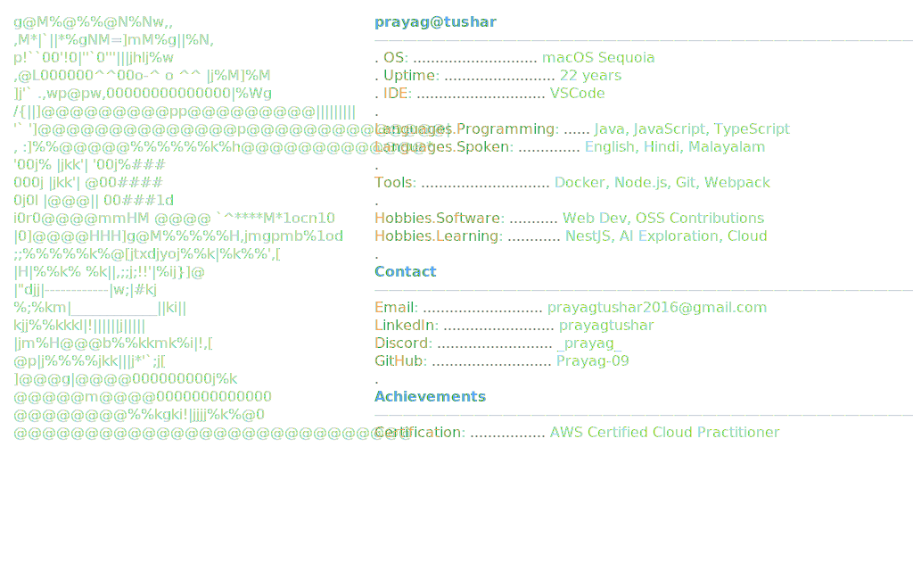

# 👋 Hey, I'm Prayag!

<a href="https://github.com/Prayag-09/Prayag-09">
  <picture>
    
  </picture>
</a>

## 🛠️ Tech Stack

### Languages

### Frameworks & Libraries

### Databases & ORMs

### DevOps & Cloud

### APIs & Authentication

### Caching

## 🏆 Achievements

- Earned **AWS Certified Cloud Practitioner** badge ([View Badge](https://www.credly.com/badges/f5c58f46-d1cf-43a9-bff6-7cad07ee64ce/public_url)).

## 📈 What I'm Up To

- 🔭 Working on **OpsVerseAI**, an intelligent PDF chat app with Stripe subscriptions.
- 🌱 Learning **Redis**, advanced **AWS** services, and **LangChain** integrations.
- 💬 Open to collabs on AI or web dev projects—DM me on [Discord](https://discord.com/users/_prayag_)!

